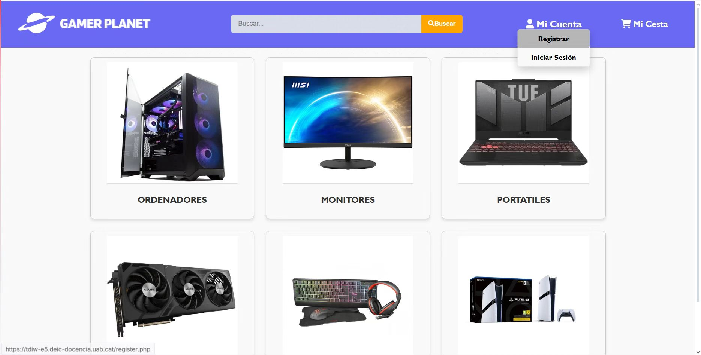
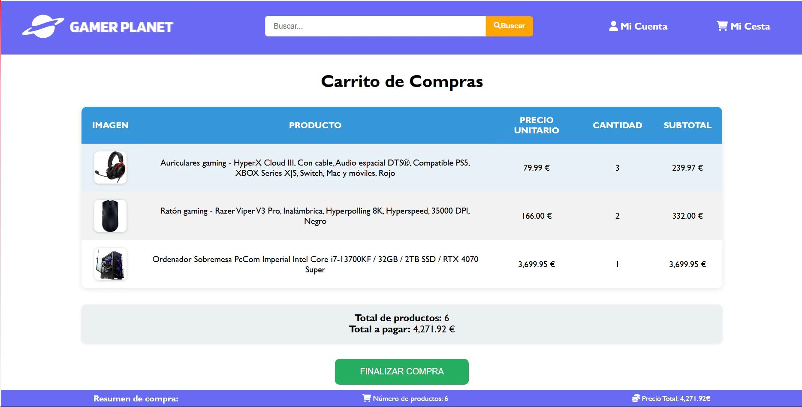
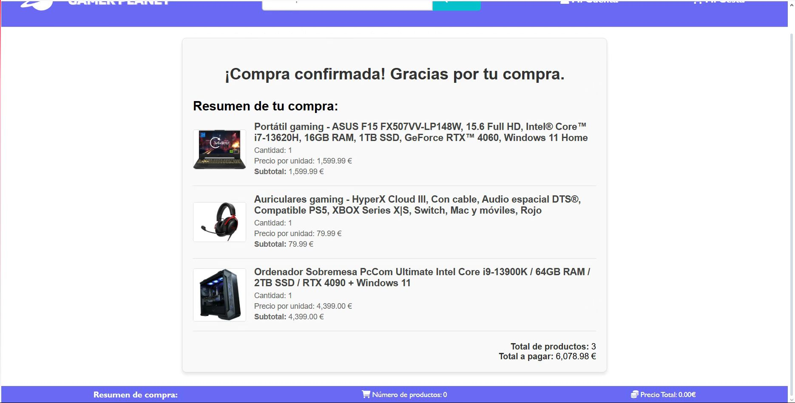

# UAB-Web-Develop-Project
## Gamer Planet: Gaming E-Commerce Website
A functional e-commerce website built using **HTML**, **CSS**, **JavaScript**, and **PHP**. The website is called "Gamer Planet", is designed to provide gamers with gaming gear such as monitors, PCs, laptops, keyboards, and more. The website features a user-friendly interface, product listings, shopping cart functionality, and a responsive design optimized for all devices.

Photos: 

